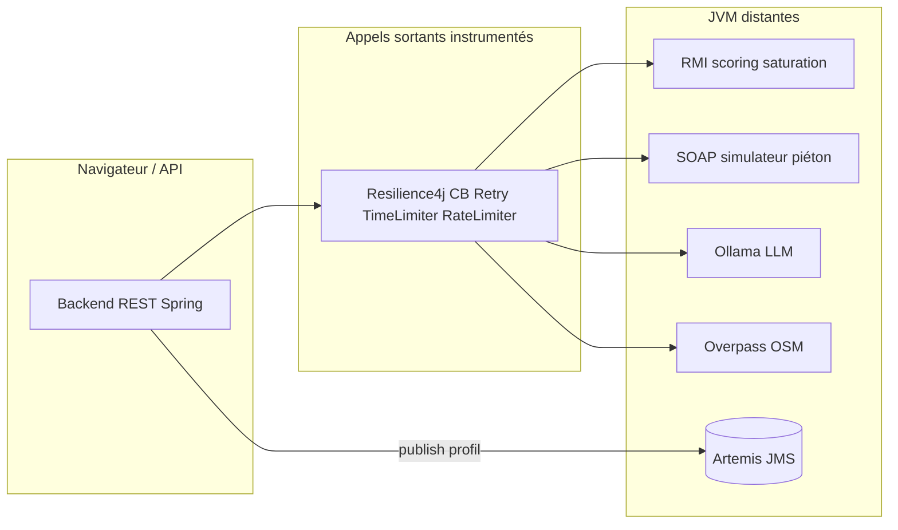

# EcoMap Invest — nœud de scoring RMI (Systèmes distribués)

Le **calcul de score de saturation** s’exécute dans une **JVM séparée**. Spring Boot est **client RMI** et expose un REST de démo.

## Démarrer avec Docker (recommandé)

À la **racine du dépôt** :

```bash
docker compose up --build -d
```

- **`rmi-scoring`** : registry **1099** + export objet **45000**, hostname RMI `rmi-scoring` (réseau Docker).
- **`artemis`** : courtier **Apache ActiveMQ Artemis** (JMS) sur **61616** — après la persistance d’un profil dynamique, le backend publie un message sur la queue `profile.generated` ; un listener invalide le cache Redis des scores pour ce profil (séparation producteur / consommateur, style middleware orienté messages).
- **`soap-foot-traffic`** : service SOAP **8092** (`/ws`) — lire la zone paramètres en base après migrations ; le backend y pointe avec `APP_FOOT_TRAFFIC_SOAP_URL`.
- **`backend`** : attend que RMI soit **healthy** (`nc` sur 1099 et 45000), se connecte à **Artemis** (`SPRING_ARTEMIS_*`), puis démarre avec `RMI_SCORING_HOST=rmi-scoring` et le client SOAP foot-traffic si le service est démarré.

Les endpoints **`/api/v1/rmi/**`** et **`POST /api/v1/soap-ft/simulate`** exigent un JWT **`ROLE_ADMIN`** (`Authorization: Bearer …`). Au démarrage, [`DataInitializer`](backend/src/main/java/com/example/backend/bootstrap/DataInitializer.java) peut créer un compte **`admin@example.com` / `admin123`** (admin) et **`user@example.com` / `user123`** (investisseur).

Sonde **légère** (sans auth, pour orchestrateurs) :

```bash
curl -s 'http://localhost:8080/api/v1/health/live'
```

Tester RMI depuis ta machine après login admin :

```bash
TOKEN=$(curl -s -X POST 'http://localhost:8080/api/v1/auth/login' \
  -H 'Content-Type: application/json' \
  -d '{"email":"admin@example.com","password":"admin123"}' | jq -r '.token')
curl -H "Authorization: Bearer $TOKEN" \
  'http://localhost:8080/api/v1/rmi/score?drivers=2&competitors=1&density=0.8'
curl -H "Authorization: Bearer $TOKEN" 'http://localhost:8080/api/v1/rmi/ping'
```

Arrêter : `docker compose down`

## Architecture

1. **`rmi-scoring-api`** — interface `ScoringRemote` (partagée).
2. **`rmi-scoring-server`** — `ScoringRemoteImpl` + registry.
3. **`backend`** — `RmiScoringClient` + `GET /api/v1/rmi/score` et `GET /api/v1/rmi/ping`.
4. **JMS (Artemis)** — `ProfileJmsPublisher` envoie après *commit* DB un `ProfileGeneratedMessage` vers la queue configurée (`app.jms.queue.profile-generated`) ; `ScoringCacheInvalidationListener` consomme en `@JmsListener` et purge les clés `score:v3:*:{profileId}:*` dans Redis.
5. **SOAP foot-traffic (`soap-foot-traffic-server`)** — simulation déterministe par cellule (archetype, baseline, pic horaire) ; le backend reste client SOAP avec repli sur le moteur embarqué si le nœud est absent. WSDL : `http://localhost:8092/ws/footTraffic.wsdl` (même schéma que `foot-traffic-simulation-contract`). Démo REST (**JWT ROLE_ADMIN**) : `POST /api/v1/soap-ft/simulate`. Variable Docker : `APP_FOOT_TRAFFIC_SOAP_URL` (déjà définie dans `docker-compose.yml`).

Santé **détaillée** (sonde registre RMI côté backend, **ADMIN uniquement**) : `GET http://localhost:8080/api/v1/admin/health/detailed` avec le même en-tête `Authorization: Bearer` que ci-dessus.

### Vue d’ensemble (REST, RMI, SOAP, JMS, Résilience4j)



**Phrase soutenance (SOAP vs RMI)** : *« Le score de saturation de marché est calculé à distance via RMI ; la simulation de fréquentation piétonnière par cellule H3 est traitée par un service SOAP dédié, avec repli local pour la stabilité du labo. »*

**Perf (recalcul grille)** : un recalcul complet envoie **un appel SOAP par cellule** ; le backend limite la concurrence via un exécuteur dédié et **Resilience4j** (`footTrafficSoap`) ; en cas d’indisponibilité du nœud SOAP, le recalcul utilise le **moteur local** (`FootTrafficSimulationEngine`) pour éviter des cellules vides.

## Build Maven sans Docker (depuis la racine)

```bash
mvn -pl rmi-scoring-server -am -DskipTests package
mvn -pl backend -am -DskipTests package
```

## Lancer le serveur RMI en local (sans Docker)

```bash
export RMI_REGISTRY_PORT=1099
export RMI_EXPORT_PORT=45000
java -Djava.rmi.server.hostname=localhost \
  -jar rmi-scoring-server/target/rmi-scoring-server-0.0.1-SNAPSHOT.jar
```

Puis Spring : `mvn -pl backend -am spring-boot:run`

Variables : `RMI_SCORING_HOST`, `RMI_SCORING_REGISTRY_PORT`, `RMI_SERVICE_NAME` (voir `application.yml`).

Si le nœud RMI est arrêté, l’API répond **503**.

Phrase soutenance : *« Le calcul de score est déporté sur un processus Java distant exposé en RMI ; l’API REST Spring joue le rôle de client RMI. »*

## Recherche carte (géocodage, POI, H3)

La barre de recherche du dashboard agrège **trois sources**, toutes **`ROLE_INVESTOR` ou `ROLE_ADMIN`** avec JWT Bearer (plus d’accès anonyme aux APIs données).

1. **Lieux** — `GET /api/v1/geocode/suggest` (Nominatim, biais viewbox Casablanca, plusieurs résultats).
2. **POI** — `GET /api/v1/poi/search` (recherche `ILIKE` sur `name` et `type_tag`).
3. **Hexagone** — saisie d’un index H3 (15–16 caractères hex) → `GET /api/v1/hexagons/h3/{h3Index}` (contour + `score: null`).

Après `docker compose up --build -d`, avec un utilisateur bootstrap **investisseur** :

```bash
INV=$(curl -s -X POST 'http://localhost:8080/api/v1/auth/login' \
  -H 'Content-Type: application/json' \
  -d '{"email":"user@example.com","password":"user123"}' | jq -r '.token')
curl -s -H "Authorization: Bearer $INV" \
  'http://localhost:8080/api/v1/geocode/suggest?q=Maarif&limit=5' | jq
curl -s -H "Authorization: Bearer $INV" \
  'http://localhost:8080/api/v1/poi/search?q=Carrefour&limit=5' | jq
curl -s -H "Authorization: Bearer $INV" \
  'http://localhost:8080/api/v1/hexagons/h3/8939aab940fffff' | jq
```

Côté frontend : `npm install` dans `frontend/` (dépendance **`h3-js`** pour résoudre la cellule H3 résolution 9 à partir d’un POI).
